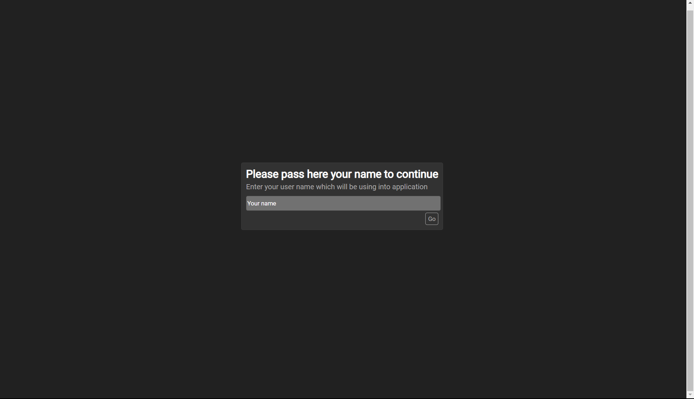

# **Short Description**
Application to make WebRTC gathering between two peer's

## Preview images
1. Determing self username

2. Attending to room and initial no active connections information

3. GUI containing Video and Text chat communication between two connected peers gathered in same connection room,


## What perform to launch app?
`Windows os example:`
```cmd
    cd ./server-http && npm run br &:: To run http signaling server
    npm run dev &:: To run gathering application the simplest way is to run application in developer mode using vite dev server
```

# **License**
This project is researching and developing under MIT license.
